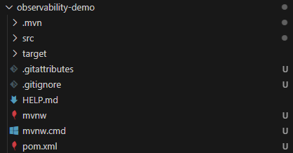
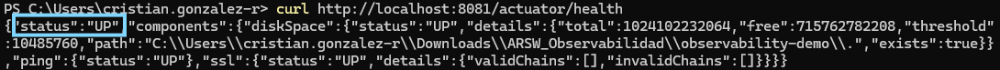

# Observabilidad - Lab

### Estructura del proyecto

### Prueba inicial de la aplicación

Ejecute la aplicación:
- mvn spring-boot:run

Pruebe el estado del servicio:
- curl http://localhost:8081/actuator/health

{"status": "UP"}

